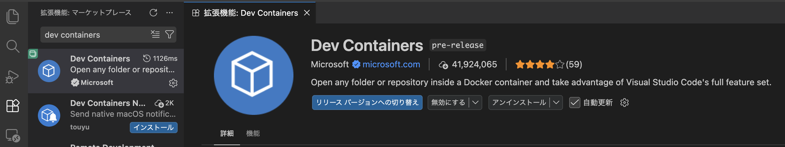
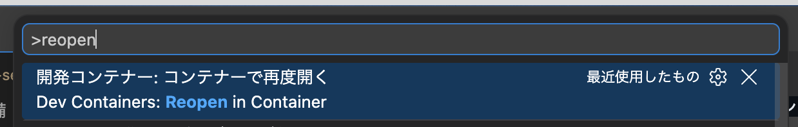

# 1-1. ハンズオン準備

ハンズオン環境をセットアップします。

## 前提条件の確認

- **VS Code** がインストールされていること
- **Docker** がインストールされていること

::: info 注意
これは、保坂さんの講義で皆さん入っているので、その確認程度です。  
入っていない場合はインストールしておいて下さい。
:::

## ZIP ファイルの展開

今回のハンズオンで使うテンプレートは、以下の URL からダウンロードできます。

<https://drive.google.com/file/d/136fwsqkJsVmUpumsyQXVGGjwFH2-84Fj/view?usp=sharing>

ダウンロードした ZIP ファイル（templates を ZIP にしたもの）を任意の場所に展開します。

## VS Code で開く

展開したディレクトリを VS Code で開いて下さい。

## Dev Containers 拡張機能のインストール

VS Code の拡張機能ビュー（`Cmd (Ctrl) + Shift + X`）から、**Dev Containers** 拡張機能をインストールします。

拡張機能 ID: `ms-vscode-remote.remote-containers`



## Dev Container で開く

1. コマンドパレット（`Cmd (Ctrl) + Shift + P`）を開く
2. 「**Dev Containers: Reopen in Container**」を実行
3. しばらく待つと、コンテナ内で VS Code が開き直される



::: info 注意
初回はイメージのビルドに時間がかかります。コンテナ内では `bun` や `valkey` が利用可能になっています。
:::

## セットアップ完了チェック

コンテナ内のターミナルで、以下のコマンドが動くことを確認します。

```bash
bun --version
```

バージョンが表示されればセットアップ完了です。
