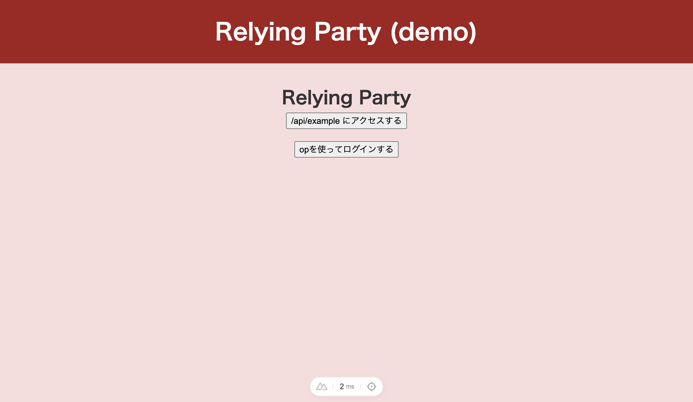
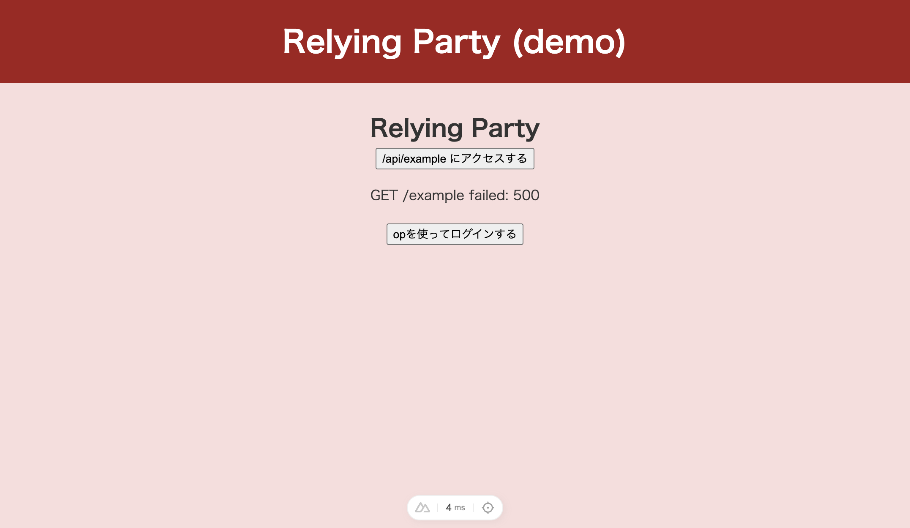
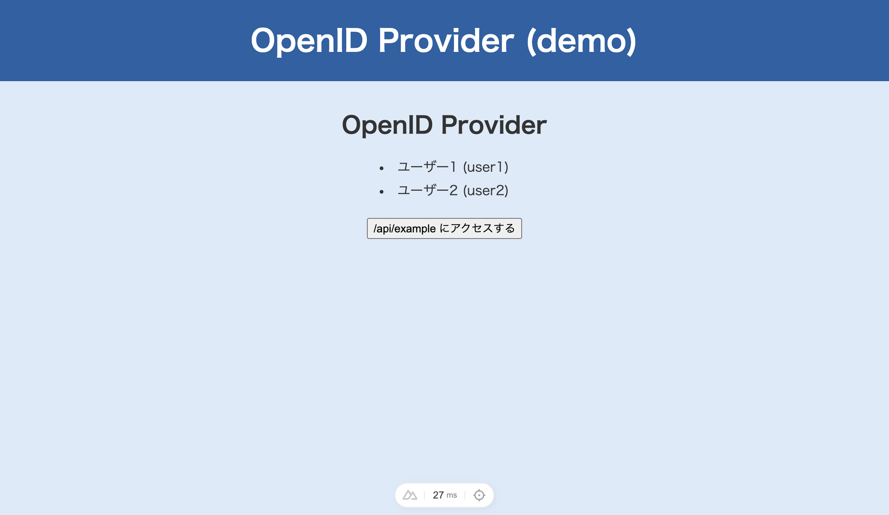
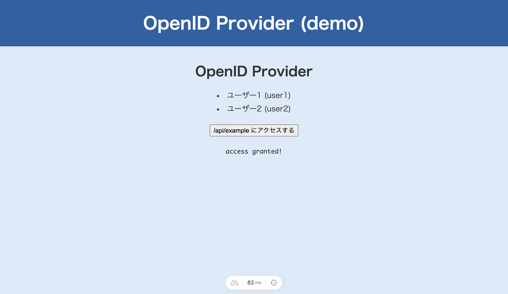

# 1-2. 進め方

ハンズオンの進め方を説明します。

## フォルダ構造の紹介

配布されたテンプレートのフォルダ構造は以下の通りです。

```plain
templates
├── packages
│   ├── shared          共有ライブラリ (ヘルパー関数・定数)
│   ├── openid-provider OpenID Provider (OP) アプリ
│   └── relying-party   Relying Party (RP) アプリ
├── package.json        コマンド定義
└── bun.lock            依存関係のロックファイル
```

- **OP** (OpenID Provider): 認可サーバー。ユーザーの認証・認可を行い、トークンを発行する
- **RP** (Relying Party): クライアントアプリ。OP にリダイレクトしてログインし、トークンを受け取る
- **shared**: OP / RP の両方から使えるヘルパー関数や定数

::: info 補足
アプリは **Nuxt** で作られています。  
Nuxt は Vue.js ベースのフレームワークで、`app/` が画面（クライアント）、`server/` が API（サーバー）の役割を担います。
:::

## 使えるコマンドの紹介

以下のコマンドが使えます。

| コマンド         | 役割                      |
| ---------------- | ------------------------- |
| `bun run dev`    | OP と RP を同時に起動する |
| `bun run check`  | 型チェックを実行する      |
| `bun run lint`   | リントを実行する          |
| `bun run format` | フォーマットを実行する    |

## 動作確認

`bun run dev` で OP と RP を同時に起動して、以下の URL にアクセスして、画面が表示されることを確認してみましょう。

- OP: <http://localhost:3001>
- RP: <http://localhost:3000>

### RP のトップページ



### RP で /api/example ボタンを押した後



認可されていないため、エラーが表示されます。  
また「opを使ってログインする」ボタンを押しても、まだ何も起きません。

### OP のトップページ



### OP で /api/example ボタンを押した後



「access granted!」と表示されます。

両方の画面が表示されれば OK です。

## 今回編集するファイルの紹介

ハンズオンで編集するファイルは以下の通りです。  
他のファイルは見なくていいので、これらのファイルを開いておけば大丈夫です。

### OP (openid-provider)

| ファイル                        | 役割                               |
| ------------------------------- | ---------------------------------- |
| `server/routes/consent.post.ts` | 認可ページから code を発行する API |
| `server/routes/token.post.ts`   | code を token に交換する API       |
| `app/pages/authorize.vue`       | 認可ページ（ユーザー選択画面）     |

### RP (relying-party)

| ファイル                                 | 役割                                     |
| ---------------------------------------- | ---------------------------------------- |
| `server/routes/authorization-url.get.ts` | authorization URL を作る API             |
| `server/routes/exchange.post.ts`         | code を token に交換する API             |
| `app/pages/index.vue`                    | トップページ（ログインボタン）           |
| `app/pages/callback.vue`                 | コールバックページ（トークン交換ボタン） |

::: info 補足
各ファイルの上部に、実装対象の関数が `// TODO: Phase N: ...` コメント付きで置かれています。この関数の中身を実装していきます。
:::
